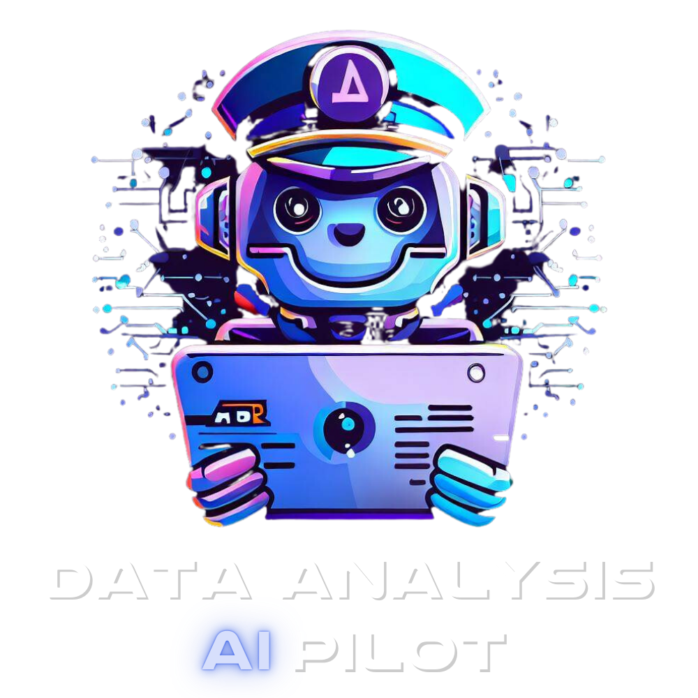
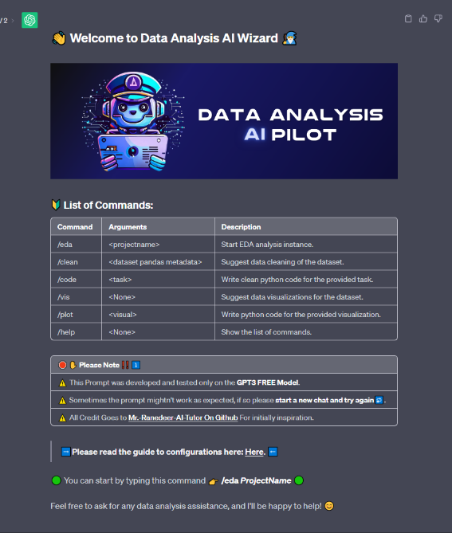

  

  <h1>👋 Welcome to DA AI Pilot 👨‍✈️</h1>

  <h2> <a href="https://hossam-elshabory.github.io/Data-Analysis-AI-Pilot/"> 📑 Official Documentation 📑 </a> </h2>

- [Quick Start Guide 🚀](#quick-start-guide-)
- [Prompt Example (DEMO) 🎮 ⤵](#prompt-example-demo--)
- [Acknowledgments 🙌](#acknowledgments-)
- [Future Prompt Development 🎮](#future-prompt-development-)

Data Analysis AI Pilot is a powerful Chat-GPT Super Prompt designed to transform Chat-GPT into your go-to data analysis and Exploratory Data Analysis (EDA) AI Assistant.

## Key Features 🔑 <!-- omit from toc -->

Data Analysis AI Pilot offers a range of robust features for you data analysis project:

- Data Cleaning and Preprocessing.
- Exploratory Data Analysis (EDA).
- Suggested Visuals and Charts.
- Code and Plot Visualizations. 

## Quick Start Guide 🚀

Start a New Chat-GPT Chat (Conversation) and paste in the prompt from in this file 👉 [DA AI Pilot Prompt]() and follow the instructions. 

## Prompt Example (DEMO) 🎮 ⤵

### Supermarket Sales EDA Project <!-- omit from toc -->

  
Click to View Prompt Screen Shot

  

## Acknowledgments 🙌

Data Analysis AI Pilot is a repurposed super prompt based on the awesome **[Mr.-Ranedeer-AI-Tutor GitHub repository](https://github.com/JushBJJ/Mr.-Ranedeer-AI-Tutor)**. Grateful for their inspiration and contribution to the AI community.

## Future Prompt Development 🎮

The current prompt provides a strong foundation for an AI assistant focused on data analysis. However, there are plans to expand its capabilities even further with additional features. The prompt will evolve over time to provide more advanced functionality.

### 1. In-depth Code Explanation <!-- omit from toc -->

- Allow the assistant to provide more detailed explanations of code snippets and data analysis processes
- Use clear, step-by-step descriptions of complex concepts to improve understanding
- Support explaining a wide range of Python data analysis libraries and machine learning algorithms

### 2. Streamlit data web app builder <!-- omit from toc -->

- Enable the assistant to prototype and build Streamlit web apps for visualizing and interacting with data
- Automatically generate Streamlit code based on a description of the desired app functionality 
- Offer suggestions for effective data visualizations and UI/UX design best practices

### 3. Machine Learning Algorithms Suggestion <!-- omit from toc -->

- Analyze data and tasks to recommend appropriate machine learning algorithms 
- Explain pros and cons of different algorithms like random forests, neural nets, etc.
- Justify recommendations based on characteristics of the data and goals of the analysis
- Fine-tune algorithm hyperparameters and parameters for improved performance

****

The prompt will continue to evolve by incorporating user feedback and new capabilities over time. The end goal is an AI assistant that provides significant value to data analysts and data scientists.